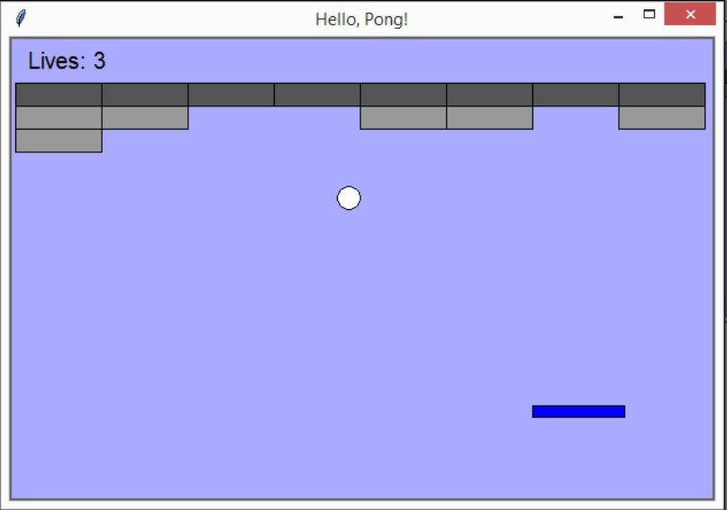

# The Breakout Game
The Breakout game starts with a paddle and a ball at the bottom of the screen and some rows of bricks at the top. The player must eliminate all the bricks by hitting them with the ball, which rebounds against the borders of the screen, the bricks, and the bottom paddle. As in Pong, the player controls the horizontal movement of the paddle.

The player starts the game with three lives, and if they miss the ball's rebound and it reaches the bottom border of the screen, one life is lost. The game is over when all the bricks are destroyed, or when the player loses all their lives.
This is a screenshot of the final version of our game:

--> Run the Main.py file and the GUI window will appear. 
